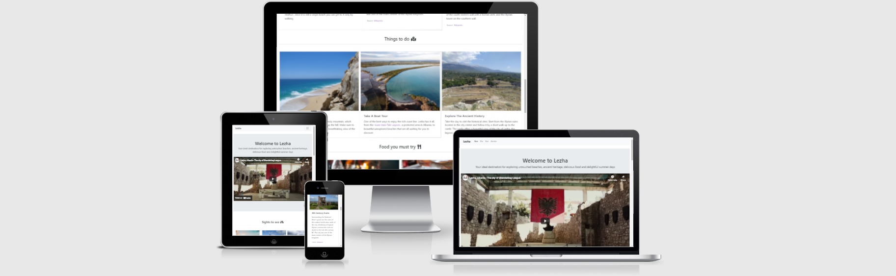

# Visit Lezha
   View the live project here : [Visit Lezha](https://elgas.github.io/visit-lezha)

   This is a website presenting a simple and effective guide for the main places and activities for a tourist that wants to vitit the city of Lezha in Albania.

   

## User Experience (UX)

-  ### User stories
   -  #### First Time Visitor Goals
       1. As a first time visitor, I want to be presented with easy to grasp information about the purpose of the site.
       2. As a first time visitor, I want to be able to navigate the site eaisly and quickly.
       3. As a first time visitor, I want the website to have appealing information and pictures that have meaning.
       4. As a first time visitor, I want to be inspired to visit this city shown on the site.
    
   -  #### Returning User Goals
        1. As a Returning Visitor, I want to find information about the places I can visit.
        2. As a Returning Visitor, I want to find information about the activities that are good to do in the city.
        3. As a Returning Visitor, I want to find information about the places I can find good food.
        4. As a Returning Visitor, I want to find a way to get in touch if I have questions.
        5. As a Returning Visitor, I want to find social media links. 
     
    -   #### Frequent User Goals
        1. As a Frequent User, I want to check to see if there are any newly added places to eat or activities.
        2. As a Frequent User, I want to get emailed any full giudes for free.
   

- ### Design
   - #### Colour Scheme
      - Since the website contains a lot of pictures and a large video, everything else is white with contrasting black font colour.
   - #### Imagery
      - The large video is the main attraction for the website, since it is enagaging and it will give a quick overview of what the city is about and its main attractions. Videos are the most used form for getting information so that will deliver that to our users. The rest of the website is designed as small displays cards with short information and to draw the user to get more information from the guide at the end.

* ### Wireframes
    
      Used balsamiq wireframe for the initial design ideas. See here: 

## Features
-  Responsive on all device sizes
-  Collapsable navigation bar in order to make more space when the user is viewing the website from smaller screen devices.

## Technologies Used

### Language Used
-  HTML5
-  CSS3

### Frameworks, Libraries & Programs Used

1. [Bootstrap 4.4.1](https://getbootstrap.com/) is used to help with the responsiveness and styling of the features.
1. [Font Awesome](https://fontawesome.com/) is used on the website to add icons for aesthetic and UX purposes.
1. [Balsamiq](https://balsamiq.com/) is used to create the wireframes during the design process.
1. [GitHub](https://github.com/) GitHub is used to store the projects code after being pushed from Gitpod.
1. [Visual Studio Code](https://code.visualstudio.com) editor was used until the final upload on Github.

## Testing

The W3C Markup Validator and W3C CSS Validator Services were used to validate the project and ensure no syntax errors in the project.

   - The W3C HTML Validator test showed no errors. - [See here](https://validator.w3.org/nu/?doc=https%3A%2F%2Felgas.github.io%2Fvisit-lezha%2F)
   - W3C CSS Validator resulted in no syntax errors in the file. - [See here](https://jigsaw.w3.org/css-validator/validator?uri=https%3A%2F%2Felgas.github.io%2Fvisitlezha%2F&profile=css3svg&usermedium=all&warning=1&vextwarning=&lang=en)

### Testing User Stories from User Experience (UX) Section
   
   -   #### First Time Visitor Goals
   
       1. As a first time visitor, I want to be presented with easy to grasp information about the purpose of the site.
       
            1. When, the users enters the site, they are immediately presented with a welcome text, and a video of the city that is mentioned.
            2. The main purpose is stated in the second line of text, and the message is clear and short.
            3. The user has the option to watch the video, and get to know about the city or scroll down to see an organized guide of the city.
       
       2. As a first time visitor, I want to be able to navigate the site eaisly and quickly.
       
            1. The site is designed to be easy to grasp and navigate, airy, light and with interesting pictures.
            2. The user can use the buttons on the navigation bar to go to different parts of the site, or has the choise to scroll dowm easily.

       4. As a first time visitor, I want the website to have appealing information and pictures that have meaning.
       
            1. The user is presented with a beautiful video of the city, which makes them curios about more information of how to explore this city.
            2. The user is presented with indormation that is paired with a visual represantation of what each small topic is about.
            3. The site shows the user in an organized, easy and logical flow the information that a tourist needs.

       6. As a first time visitor, I want to be inspired to visit this city shown on the site.
       
            1. The user is being presented a lot of appealing information, pictures, and activities that would make them want to visit the city.
   
   -   #### Returning Visitor Goals
   
        1. As a Returning Visitor, I want to find information about the places I can visit.
         
            1. The user is presented with the video showing them all the places they can visit.
            2. After the video, the user is presented with three options, on the section "Sights to see".
            3. The option cards have an appealing image, and some text to inform the user and direct them to more facts about the places.

        2. As a Returning Visitor, I want to find information about the activities that are good to do in the city.
          
            1. The user is presented with three options, included in the section named "Things to do".
            2. In each small section the user can see the a picture of the place the can do a specific activity at.

        3. As a Returning Visitor, I want to find information about the places I can find good food.
        
            1. The user can find this information on the section "Food you must try".
            2. In this section the user is presented with two possibilities, ranked as the best places in the city.

        4. As a Returning Visitor, I want to find a way to get in touch if I have questions.

            1. The user can fill in the form at the end of the site, to send in any questions they might have.
            2. They can do that by following the links to the social media.

        5. As a Returning Visitor, I want to find social media links.

            1. The social media accounts are linked at the footer of the page, and the user is invited to follow by a short message.
   
   -   #### Frequent User Goals
   
         1. As a Frequent User, I want to check to see if there are any newly added places to eat or activities.

            1. Since the user is already familiar, they can asily spot new places or activities added.
          
         2. As a Frequent User, I want to get emailed any full giudes for free.
         
            1. The form invites the user to fill in their information in order to get a free guide of the city. (Submit button not active for the present)
      

 ### Further Testing
 
 - The website was tested on Google Chrome, Microsoft Edge and on these devices desktop, laptop, iPhone5, Huawei P20 Pro.
 - Rigorous testing was done for all the internal and external links that the site contains.
 - Friends and family members were asked to visit the site and give feedback on their experience.
 - Checked all alternative text for all the image element.
 - Tested the uploading speed (result 1.4 s) of the website since it is important for a good UX, and Google rankings.

        
## Deployment    
    
### GitHub Pages

The project was deployed to GitHub Pages using the following steps:

1. Log in to GitHub and locate the [GitHub Repository](https://github.com/)
2. At the top of the Repository page, locate the "Settings" Button on the menu.
3. Scroll down the Settings page until you locate the "Pages" Section.
4. Under "Source", click the dropdown called "None" and select "Branch : master".
5. Click the "Save" button.
6. The page will automatically refresh.
7. Go back down to the Repository page to locate the now published site [link](https://github.com) in the "GitHub Pages" section.
 

## Credits

### Code

 - [Bootstrap 4.4.1](https://getbootstrap.com/) Library was used throughout the 
  project to make the site responsive and appealing by using the card features.

### Content

   - Most of the content was written by the developer.
   - Two features have been suorced from Wikipedia, and is linked accordingly.

### Media

   - [Unsplash](https://unsplash.com/) for all the pictures used, as a free image source.
   - [YouTube](https://www.youtube.com/watch?v=O7abP6M0Nt4) for the video.
        

## Acknowledgements

    - My Mentor for continuous helpful feedback and support.
    - Student Care at Code Institute for their support.

