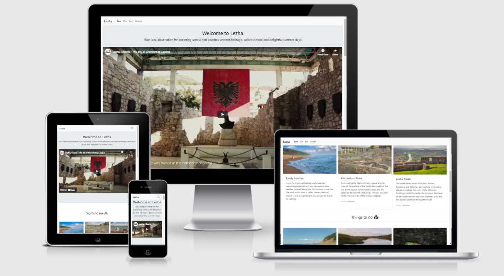

# Visit Lezha
Live project here : [Visit Lezha](https://elgas.github.io/visit-lezha)

This is a website presenting a simple and effective guide for the main places and activities for a tourist 
that wants to vitit Lezha in Albania.

## User Experience (UX)

### User stories

    * First Time Visitor Goals
        a. As a first time visitor, the website should feel light and easy to grasp. It should give the 
        right information quickly. 
        b. The website should be easily scrollable on the phone, and fun to navigate.
        c. It should convey the right information in a simple and engaging way.
    
    * Returning Visitor Goals
        a. As a returning visitor, I might be looking for an idea on what to do in the city.
        b. Returning visitors, will want to get an updated tourist guide.
    

### Design

    * Colour Scheme : Since the website contains a lot of pictures and a large video, everything else is
     white with contrasting black font colour.

    * Imagery: The large video is the main attraction for the website, since 
    its enagaging and it will give a quick overview of what the city is about. 
    Videos are the most used form for getting information. The rest of the website 
    is designed as small displays cards with short information in order to draw 
    the user to get more information from the guide at the end.

## Wireframes
    
Used balsamiq wireframe for the initial design ideas. See here: 

## Features
    * Responsive on all device sizes 
    * Collapsable navigation bar in order to make more space when the user is viewing 
    the website from smaller screen devices.
    * Sections that display activities, sights, and the food of the city presented with 
    easy text and a memorable image.
    * The user can submit their information in a form in order to get a free tourist guide.

## Technologies Used

### Language Used
    * HTML5
    * CSS3

### Frameworks Used
[Bootstrap 4.4.1](https://getbootstrap.com/) is
     used to help with the responsiveness and styling of the features.

[Font Awesome](https://fontawesome.com/) is used on the website 
    to add icons for aesthetic and UX purposes.

[Balsamiq](https://balsamiq.com/) is used to create the wireframes 
    during the design process.

[GitHub](https://github.com/): GitHub is used to store the projects 
    code after being pushed from Gitpod.

[Visual Studio Code](https://code.visualstudio.com) editor was used until the final upload on Github.

## Testing

    * Validator testing
     - The W3C HTML Validator test showed no errors, but one suggestion of using CSS instead of the <iframe> 
     element in HTML. 
[See here](https://validator.w3.org/nu/?doc=https%3A%2F%2Felgas.github.io%2Fvisit-lezha%2F) 
    
     - W3C CSS Validator resulted in no syntax errors in the file. 
[See here](https://jigsaw.w3.org/css-validator/validator?uri=https%3A%2F%2Felgas.github.io%2Fvisit-lezha%2F&profile=css3svg&usermedium=all&warning=1&vextwarning=&lang=en)

    * Testing User Stories from User Experience (UX) Section
        -The website delivers simple information in a clear setting. 
        -The video and images make it appealing and enjoyable.
        -The user has the option to enter first and last name, email, 
        select a language and get a free guide.

    * Further Testing
        - The website was tested on Google Chrome, Microsoft Edge and 
        on these devices desktop, laptop, iPhone5, Huawei P20 Pro.
        - Rigorous testing was done for all the internal and external 
        links that the site contains.
        - Friends and family members were asked to visit the site and 
        give feedback on their experience.
        - Checked all alternative text for all the image element.
        - Tested the uploading speed (result 1.4 s)of the website 
        since it is important for a good UX, and Google rankings.

    * Fixed bugs
        - Bootstrap was used in order to make the website responsive, 
        but all the images that the website contains had to be fixed 
        by using CSS media queries, for four breaking points. Before 
        adding the necessary fixes, the images had different sizes while 
        moving through the screen breakpoints.
        - The collapsable menu was covering the content in small screen divices, 
        fixed by deactivating it when the screen is smaller.

## Deployment
    The project was deployed to GitHub Pages using the following steps:

    - Log in to GitHub and locate and open the wanted GitHub repository.
    - In the GitHub repository navigate to the Settings tab.
    - From the source section drop-down menu, select the Master Branch
    - Next select folder and click on the save button. 
    - The page automatically refreshes with a message to indicate 
    the successful deployment.
    - Wait a few minutes and then you can click the link that Github 
    has created for hosting the website.
 

## Credits
 ### Code
  [Bootstrap 4.4.1](https://getbootstrap.com/) Library was used throughout the 
  project mainly to make site responsive and appealing.

### Content
    Most of the content was written by the developer.
    Two features have been suorced from Wikipedia, and is linked accordingly.

### Media
- Image source for most images [Shutterstock source](https://www.shutterstock.com/)
- Free image source [Pexel](https://www.pexels.com/)
- Free image source [Unsplash](https://unsplash.com/)
- Video source [YouTube](https://www.youtube.com/watch?v=O7abP6M0Nt4)
        

## Acknowledgements
    My Mentor for continuous helpful feedback and support.

